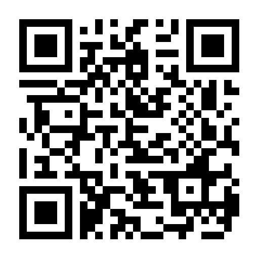
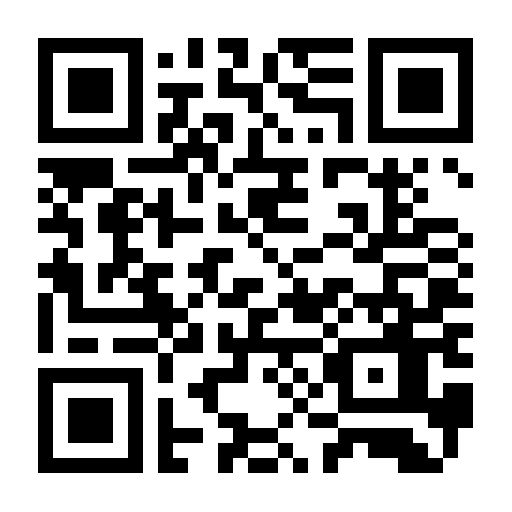
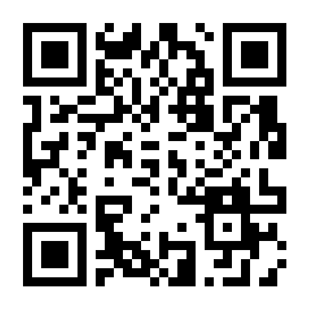

  

<h1 align="center">VeSBP</h1>

Оплата по СБП: выбор банка, преобразование в QR-код и платёжную ссылку.

  
  
  
  
  

## О проекте

VeSBP помогает открыть оплату через СБП с другого устройства. Приложение получает ссылку, переданную выбранным банком, формирует стандартную ссылку НСПК и показывает соответствующий QR-код.

На текущем этапе поддерживается Углеметбанк. Список банков можно расширять.

VeSBP не проводит платежи, не списывает денежные средства и не получает доступ к банковскому аккаунту пользователя.

## Как пользоваться

1. При оплате через СБП выберите банк, который указан в приложении.
2. Откройте сформированную ссылку в VeSBP или выберите VeSBP в меню «Поделиться».
3. Отсканируйте QR-код с другого устройства либо скопируйте платёжную ссылку.

## Установка

Готовые APK будут публиковаться в разделе [Releases](https://github.com/Q3D-Tech/VeSBP/releases).

## Ссылки

- [GitHub](https://github.com/Q3D-Tech/VeSBP)
- [Telegram-группа VeSBP](https://t.me/verisbp)
- [VeriShop](https://t.me/VeriShopBot)

## Лицензия

Проект распространяется по [лицензии MIT](LICENSE).

## Поддержать проект ❤️

Будем рады вашей поддержке. Пожалуйста, отправляйте актив только через указанную сеть. Нажмите на QR-код, чтобы открыть его в полном размере.

| Актив | Сеть | Адрес | QR-код |
| --- | --- | --- | --- |
| USDT | TRC20 | `THDdetaN5hyL8ZxctC75aTBSDT4bDUKtYC` |  |
| USDT | ERC20 / BEP20 / Polygon | `0x4ead462500337829bB6cDEB437187CC4eBE755dC` |  |
| USDT | Solana | `EdURB1MUpTQjUi4UWLBpw7tQARWkcHCm3tSzBFnYHHB6` |  |
| USDC | Arbitrum One / ERC20 / Base | `0x4ead462500337829bB6cDEB437187CC4eBE755dC` |  |
| ETH | ERC20 | `0x4ead462500337829bB6cDEB437187CC4eBE755dC` |  |
| POL | Polygon | `0x4ead462500337829bB6cDEB437187CC4eBE755dC` |  |
| BTC | Bitcoin | `bc1q6k5xqdvwt9mmy38d9fnmwsk6efnrn1r8jqe0mj` |  |
| TRX | Tron | `THDdetaN5hyL8ZxctC75aTBSDT4bDUKtYC` |  |
| SOL | Solana | `EdURB1MUpTQjUi4UWLBpw7tQARWkcHCm3tSzBFnYHHB6` |  |
| GRAM | TON | `UQBIET64WYFty_VVPfH0NAruWnan91H6fbt81VSY0GN5i1Q8` |  |
